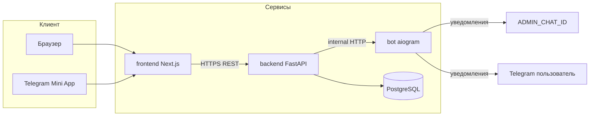

# My Shop

Интернет-магазин с **единым фронтендом** для браузера и **Telegram Mini App**: каталог, корзина, оформление заказов, личный кабинет заказов и админка. Бэкенд — единственный источник истины для **цен**, **состава заказа** и **статусов**; фронтенд лишь отображает данные и вызывает API.

Проект ориентирован на **реальный продакшен**: отдельные процессы API, бота, UI и PostgreSQL, описанные в **Docker Compose**.

---

## Содержание

- [Возможности](#возможности)
- [Архитектура](#архитектура)
- [Структура репозитория](#структура-репозитория)
- [Требования](#требования)
- [Быстрый старт (Docker Compose)](#быстрый-старт-docker-compose)
- [Продакшен: Caddy и TLS](#продакшен-caddy-и-tls)
- [Переменные окружения](#переменные-окружения)
- [API (обзор)](#api-обзор)
- [Заказы, превью и уведомления](#заказы-превью-и-уведомления)
- [Telegram: Mini App и виджет входа](#telegram-mini-app-и-виджет-входа)
- [Локальная разработка без Docker](#локальная-разработка-без-docker)
- [Продакшен: чеклист](#продакшен-чеклист)
- [Данные и миграции](#данные-и-миграции)
- [Устранение неполадок](#устранение-неполадок)

---

## Возможности

### Покупатель

- Просмотр каталога и карточки товара.
- Корзина в браузере (**localStorage**); количество и состав сохраняются между визитами.
- **Превью заказа** при оформлении: сервер пересчитывает позиции и **итог по актуальным ценам** (эндпоинт `POST /api/orders/preview`).
- Оформление заказа с телефоном, адресом и способом оплаты (наличные / перевод).
- Раздел **«Мои заказы»**: список и детализация заказа.
- **Отмена заказа** покупателем, пока статус `NEW` или `CONFIRMED`.
- Вход только через **Telegram** (Mini App или Login Widget в браузере).

### Администратор

- Управление товарами и категориями (через UI `/admin`).
- Просмотр всех заказов и смена статуса (`NEW` → `CONFIRMED` → `SHIPPED` → `DELIVERED`, а также `CANCELLED`).
- Доступ к админке по списку **Telegram user id** в `ADMIN_TELEGRAM_IDS`.

### Интеграция с ботом

- Внутренний HTTP у бота принимает от бэкенда события и:
  - отправляет **подробное уведомление администратору** в `ADMIN_CHAT_ID` (новый заказ в развёрнутом виде);
  - при необходимости отправляет **текст покупателю** в личку Telegram (создание заказа, смена статуса админом, отмена покупателем);
  - дублирует **служебную заметку админу** (например, «покупатель отменил заказ №…»).

Защита: заголовок `X-Internal-Secret` и значение `BOT_INTERNAL_SECRET`.

---

## Архитектура



| Компонент | Технологии | Роль |
|-----------|------------|------|
| **backend** | FastAPI, SQLAlchemy 2.x, Alembic, asyncpg, JWT, Pydantic | REST API, каталог, заказы, превью корзины, админ-роуты, проверка подписи Telegram |
| **frontend** | Next.js 14 (App Router), React 18, Tailwind CSS | Один UI для веба и Mini App; корзина на клиенте; страницы каталога, корзины, чекаута, «Мои заказы», админка |
| **bot** | aiogram 3, aiohttp (внутренний сервер), aiogram_dialog | Меню Mini App, `/start`, приём **внутренних** POST с уведомлениями |
| **db** | PostgreSQL 16 | Пользователи, категории, товары, изображения, заказы, позиции заказов |

**Принципы:**

- Бот **не** хранит заказы и **не** считает суммы.
- Клиент показывает сумму в корзине ориентировочно; **официальная** сумма — из превью/ответа API при оформлении.

---

## Структура репозитория

```
my_shop/
├── backend/           # FastAPI-приложение, модели, миграции Alembic
│   ├── app/
│   │   ├── api/routes/    # auth, catalog, orders, admin
│   │   ├── models/
│   │   ├── schemas/
│   │   ├── services/      # каталог, заказы, notifier → бот
│   │   └── main.py
│   └── alembic/
├── bot/               # Telegram-бот + внутренний HTTP :8081
├── frontend/          # Next.js
│   ├── app/           # страницы App Router
│   ├── components/
│   └── lib/           # api.ts, auth, cart
├── docker-compose.yml          # локальная разработка (порты 3000/8000/8081/5432)
├── docker-compose.prod.yml     # продакшен: только Caddy 80/443 наружу
├── caddy/                      # Caddyfile для TLS и маршрутизации
├── DEPLOY.md                   # гайд по деплою (Timeweb, firewall)
├── .env.prod.example           # пример .env для prod Compose
├── .env.example
└── README.md
```

---

## Требования

- **Docker** и плагин **Docker Compose** (`docker compose`, не устаревший отдельный бинарь `docker-compose`, если у вас не так принято).
- Для работы без контейнеров: **Python 3.12**, **Node.js 22**, **PostgreSQL 16** (см. ниже).

---

## Быстрый старт (Docker Compose)

1. **Склонируйте репозиторий** и перейдите в корень проекта.

2. **Создайте файл окружения:**

   ```bash
   cp .env.example .env
   ```

3. **Заполните `.env`**: обязательно задайте осмысленные секреты и Telegram-поля (см. [Переменные окружения](#переменные-окружения)). Не публикуйте реальные токены и не коммитьте боевой `.env`.

4. **Поднимите стек:**

   ```bash
   docker compose up --build
   ```

5. **Откройте в браузере:**

   | Назначение | URL |
   |------------|-----|
   | Фронтенд | http://localhost:3000 |
   | API | http://localhost:8000 |
   | OpenAPI (Swagger) | http://localhost:8000/docs |
   | Health API | http://localhost:8000/health |
   | Health внутреннего HTTP бота | http://localhost:8081/health |

При первом старте контейнера **backend** выполняются миграции Alembic и при **пустой** базе может выполняться засев демо-каталога (см. код инициализации в репозитории).

### Остановка и тома

- Остановка: `docker compose down`.
- Данные PostgreSQL сохраняются в томе `postgres_data`.
- Полный сброс БД: `docker compose down -v` (**все данные в PostgreSQL будут удалены**).

## Продакшен: Caddy и TLS

Для выкладки в бой используйте **`docker-compose.prod.yml`** и **Caddy**: наружу только **80** и **443**, PostgreSQL и внутренний HTTP бота не публикуются.

1. Скопируйте [`.env.prod.example`](.env.prod.example) в `.env` (или иной файл и передайте `--env-file`).
2. Заполните `PRIMARY_DOMAIN`, `NEXT_PUBLIC_API_URL`, `MINI_APP_URL`, `CORS_ORIGINS`, секреты и Telegram.
3. Запуск:

   ```bash
   docker compose -f docker-compose.prod.yml --env-file .env up -d --build
   ```

Файлы Caddy: [`caddy/Caddyfile`](caddy/Caddyfile) (один домен, маршрут `/api*` → бэкенд), [`caddy/Caddyfile.subdomain`](caddy/Caddyfile.subdomain) (API на поддомене), [`caddy/Caddyfile.selfsigned`](caddy/Caddyfile.selfsigned) (TLS `internal` для локальных тестов).

Пошагово: firewall, Timeweb, DNS — **[DEPLOY.md](DEPLOY.md)**.

---

## Переменные окружения

Имена и значения по умолчанию в Compose смотрите в `docker-compose.yml`. Ниже — смысл переменных.

### Общие / инфраструктура

| Переменная | Где используется | Назначение |
|------------|------------------|------------|
| `POSTGRES_DB` | PostgreSQL, формирование `DATABASE_URL` | Имя базы |
| `POSTGRES_USER` | PostgreSQL | Пользователь БД |
| `POSTGRES_PASSWORD` | PostgreSQL | Пароль пользователя БД |
| `DATABASE_URL` | backend (в Compose задаётся автоматически) | URL async SQLAlchemy, например `postgresql+asyncpg://user:pass@db:5432/shop` |

### Бэкенд

| Переменная | Назначение |
|------------|------------|
| `JWT_SECRET` | Секрет подписи JWT (длинная случайная строка в продакшене). |
| `JWT_ALGORITHM` | По умолчанию `HS256` (см. `app/core/config.py`). |
| `TELEGRAM_BOT_TOKEN` | Токен бота от [@BotFather](https://t.me/BotFather); используется для проверки `initData` / Login Widget. |
| `ADMIN_TELEGRAM_IDS` | Список **числовых** Telegram user id администраторов через запятую. |
| `CORS_ORIGINS` | Разрешённые `Origin` для браузера, **через запятую** (локально: `http://localhost:3000`; в проде — ваши `https://...`). |
| `BOT_INTERNAL_URL` | URL эндпоинта бота для уведомлений. В Compose: `http://bot:8081/internal/order-notification`. |
| `BOT_INTERNAL_SECRET` | Общий секрет бэкенда и бота; передаётся заголовком `X-Internal-Secret`. |
| `TELEGRAM_AUTH_MAX_AGE_SECONDS` | Допустимый возраст данных авторизации Telegram (см. config). |

### Фронтенд

| Переменная | Назначение |
|------------|------------|
| `NEXT_PUBLIC_API_URL` | Базовый URL API **с суффиксом `/api`**, как его видит браузер (например `http://localhost:8000/api`). Важно: при **сборке** образа попадает в клиентский бандл — меняя URL, пересобирайте фронтенд. |
| `NEXT_PUBLIC_TELEGRAM_BOT_USERNAME` | Username бота **без** `@` (виджет и Mini App). |

### Бот

| Переменная | Назначение |
|------------|------------|
| `BOT_TOKEN` | В Docker обычно пробрасывается из `TELEGRAM_BOT_TOKEN`. |
| `MINI_APP_URL` | Публичный URL фронтенда для кнопки WebApp и ссылок (в продакшене — **HTTPS**). |
| `ADMIN_CHAT_ID` | Чат (или user id), куда бот шлёт админские уведомления о заказах. Если не задан, часть уведомлений пропускается (см. логи бота). |
| `BOT_INTERNAL_SECRET` | Должен совпадать с бэкендом. |
| `BOT_INTERNAL_HOST` / `BOT_INTERNAL_PORT` | Адрес прослушивания внутреннего HTTP (по умолчанию `0.0.0.0:8081`). |

---

## API (обзор)

Префикс API по умолчанию: **`/api`**. Полная схема — в **Swagger**: `http://localhost:8000/docs`.

### Публичный каталог

- `GET /api/categories` — категории.
- `GET /api/products` — товары (фильтры query: `category_id`, `search`).
- `GET /api/products/{id}` — карточка товара.

### Авторизация (Telegram → JWT)

- `POST /api/auth/telegram-mini-app` — тело `{ "init_data": "..." }`.
- `POST /api/auth/telegram-login` — данные Telegram Login Widget.
- `GET /api/auth/me` — профиль (заголовок `Authorization: Bearer <token>`).

### Заказы (покупатель)

- `POST /api/orders/preview` — расчёт позиций и суммы по текущему каталогу (**без создания заказа**; не требует JWT).
- `POST /api/orders` — создать заказ (JWT обязателен).
- `GET /api/orders` — список заказов текущего пользователя.
- `GET /api/orders/{id}` — детали заказа (только свой).
- `POST /api/orders/{id}/cancel` — отмена (только `NEW` или `CONFIRMED`).

### Админка (JWT + проверка `ADMIN_TELEGRAM_IDS`)

- `GET/POST/PATCH/DELETE ...` — товары и категории (см. Swagger).
- `GET /api/admin/orders` — все заказы, опционально `?status=`.
- `PATCH /api/admin/orders/{id}/status` — смена статуса.

---

## Заказы, превью и уведомления

### Статусы заказа

| Значение | Смысл |
|----------|--------|
| `NEW` | Только что создан. |
| `CONFIRMED` | Подтверждён магазином. |
| `SHIPPED` | Отправлен. |
| `DELIVERED` | Доставлен. |
| `CANCELLED` | Отменён (админом или покупателем в разрешённых статусах). |

### Превью и оформление

- В корзине клиент может хранить **устаревшие цены**. Перед оплатой UI вызывает **`POST /orders/preview`** с `product_id` и `quantity`.
- Если товар выключен (`is_active=false`) или id не найден, API вернёт **400** с понятным текстом на русском; то же при создании заказа.
- Итог в ответе `POST /orders` — тот, который сохранён в БД (источник истины).

### Уведомления Telegram

Бэкенд отправляет на бота JSON (см. код `app/services/notifier.py` и обработчик в `bot/app/main.py`):

- **`admin_order`** — полное тело заказа для развёрнутого сообщения админу.
- **`admin_note`** — короткая служебная строка админу (например отмена покупателем).
- **`customer`** — объект `{ "telegram_id", "text" }` для сообщения покупателю.

Покупатель получает уведомления, только если **написал боту** / не заблокировал его (ограничение Telegram Bot API).

---

## Telegram: Mini App и виджет входа

1. Создайте бота в [@BotFather](https://t.me/BotFather), получите `TELEGRAM_BOT_TOKEN`.
2. Укажите **домен** для Login Widget и настройте **Menu Button / Web App** на ваш **публичный HTTPS** URL фронтенда (`MINI_APP_URL`).
3. В `.env` задайте `NEXT_PUBLIC_TELEGRAM_BOT_USERNAME` **без** `@`.
4. Для локальных тестов Mini App часто используют туннель с HTTPS (ngrok, cloudflared и т.п.), так как Telegram требует корректный HTTPS для продакшен-сценариев.

**CORS:** в `CORS_ORIGINS` должны быть все origin’ы, с которых открывается фронтенд (включая HTTPS Mini App, если он отличается от основного сайта).

---

## Локальная разработка без Docker

1. Поднимите PostgreSQL 16, создайте БД и пользователя.
2. **Backend:** установите зависимости (`pip` по вашему процессу), задайте `DATABASE_URL`, секреты и Telegram, выполните `alembic upgrade head`, запустите приложение (см. `backend/Dockerfile`, типично `uvicorn app.main:app --host 0.0.0.0 --port 8000`).
3. **Frontend:** `npm install`, задайте `NEXT_PUBLIC_API_URL` и `NEXT_PUBLIC_TELEGRAM_BOT_USERNAME`, `npm run dev`.
4. **Bot:** задайте переменные как в `bot/app/config.py`, убедитесь, что **`BOT_INTERNAL_URL` на бэкенде** указывает на доступный с машины разработчика адрес бота (например `http://localhost:8081/internal/order-notification`), если бот запущен локально.

Команды фронтенда:

```bash
cd frontend
npm run dev       # разработка
npm run build     # продакшен-сборка
npm run typecheck # проверка TypeScript
npm run lint      # ESLint (Next.js)
```

---

## Продакшен: чеклист

- [ ] Запуск через **`docker-compose.prod.yml`** + **Caddy**, см. [DEPLOY.md](DEPLOY.md) и раздел [Продакшен: Caddy и TLS](#продакшен-caddy-и-tls).
- [ ] Сильные уникальные **`JWT_SECRET`** и **`BOT_INTERNAL_SECRET`**; не хранить в открытом виде в репозитории.
- [ ] **`NEXT_PUBLIC_API_URL`** указывает на публичный API с `/api`; после смены — **пересборка** фронтенда.
- [ ] **HTTPS** на доменах фронтенда и API; корректный **`MINI_APP_URL`**.
- [ ] **`CORS_ORIGINS`** содержит только доверенные origin’ы.
- [ ] PostgreSQL **не** торчит в интернет без необходимости; сильный пароль или managed-инстанс.
- [ ] Доступ к **`BOT_INTERNAL_URL`** только из частной сети / с сервера API, не публиковать без защиты.
- [ ] Настроен **`ADMIN_CHAT_ID`** для оперативных уведомлений.
- [ ] Мониторинг логов `backend`, `bot`, обратный прокси (Nginx, Caddy) по желанию.

---

## Данные и миграции

Основные сущности в БД:

- `users` — привязка к `telegram_id`.
- `categories`, `products`, `product_images`.
- `orders`, `order_items` — заказ, позиции с **зафиксированной ценой** строки на момент заказа.

Миграции: каталог `backend/alembic/versions/`. Новая схема — через `alembic revision` и проверка на стенде перед продакшеном.

---

## Устранение неполадок

| Симптом | Что проверить |
|---------|----------------|
| CORS error в браузере | `CORS_ORIGINS`, точное совпадение схемы/домена/порта с тем, откуда открыт сайт. |
| 401 при заказах | JWT истёк или не передаётся; перелогин через Telegram. |
| Нет уведомлений в Telegram | `ADMIN_CHAT_ID`, токен бота, доступность `BOT_INTERNAL_URL` с контейнера backend, совпадение `BOT_INTERNAL_SECRET`, писал ли пользователь боту (для личных уведомлений). |
| Mini App не открывается | HTTPS, корректный `MINI_APP_URL`, настройки домена в BotFather. |
| Превью/заказ: «товары недоступны» | Товар снят с продажи или id не совпадает с каталогом — обновите корзину. |
| Фронтенд бьёт не в тот API | `NEXT_PUBLIC_API_URL` при сборке и в runtime контейнера. |

---

**Кратко:** скопируйте `.env` из `.env.example`, задайте секреты и Telegram, выполните `docker compose up --build`. Для боя добавьте HTTPS, жёсткие секреты, узкий CORS и защиту внутреннего канала до бота.
